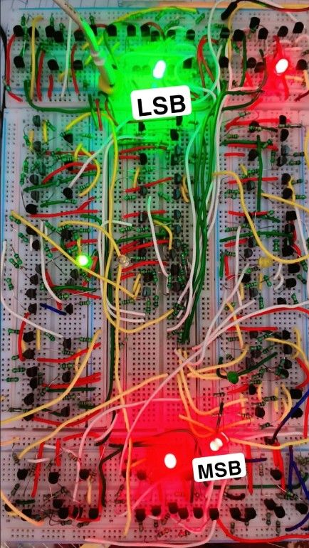
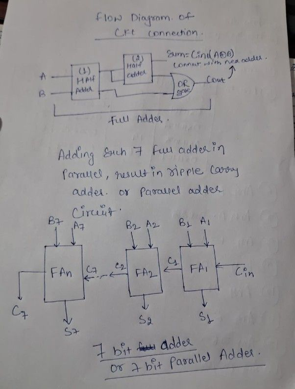
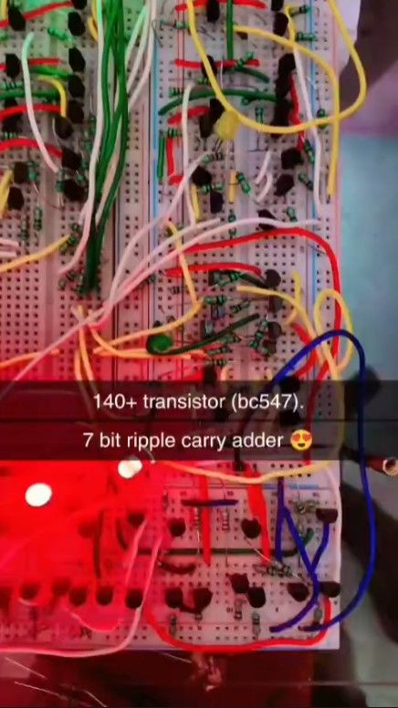
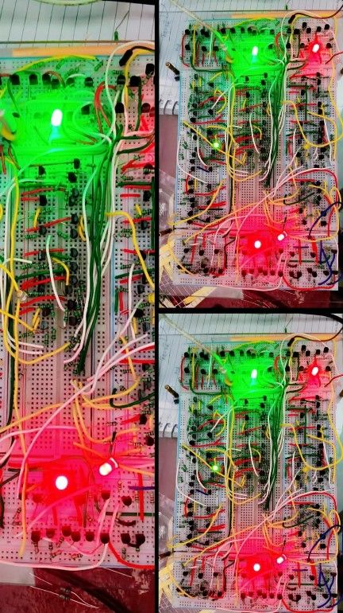

# 🔌 7-Bit Ripple Carry Adder — Built from 140+ Discrete Transistors

A **7-bit Ripple Carry Adder** built completely from scratch on breadboard using **140+ BC547 transistors** — no adder ICs, no simulator, no FPGA. Every AND, OR, and XOR gate needed for the Half Adders and Full Adders was built at the transistor level, then wired into a full 7-bit binary adder.

<p align="center">
  
</p>

---

## 📖 Overview

A **Full Adder** is built from two **Half Adders** plus an OR gate:

```
        Sum = Cin ⊕ (A ⊕ B)
A ──┐
    ├─▶ [Half Adder 1] ──▶ [Half Adder 2] ──▶ Sum
B ──┘         │                   │
              └────────┬──────────┘
                        ▼
                     [OR gate] ──▶ Cout
```

Chaining **7 of these Full Adders** together — where the `Cout` of each stage feeds the `Cin` of the next — gives a **7-bit Ripple Carry Adder / Parallel Adder**:

```
 B7,A7            B2,A2            B1,A1
   │                │                │
   ▼                ▼                ▼
┌──────┐   C7   ┌──────┐   C2   ┌──────┐
│ FA_n │◀───────│ FA_2 │◀───────│ FA_1 │◀── Cin
└──────┘        └──────┘        └──────┘
   │                │                │
   ▼                ▼                ▼
  C7,S7             S2               S1
```

*(Hand-drawn circuit flow diagram below — this is the actual design sketch used before wiring it up.)*

<p align="center">
  
</p>

**Inputs:** Two 7-bit binary numbers (A7…A1 and B7…B1)
**Outputs:** 7-bit Sum + final Carry-Out (C7)

---

## 🧰 Components Used

| Component | Details |
|---|---|
| BC547 NPN Transistors | **140+**, used to build every logic gate (AND/OR/XOR/NOT) from scratch |
| Resistors | Base & pull-up/pull-down resistors for transistor switching logic |
| Breadboards | Multiple boards chained together for the full 7-bit circuit |
| LEDs (Green + Red) | Output indicators — **Green = LSB side**, **Red = MSB side** |
| Jumper wires (color-coded) | Yellow/Red/Green/White wires for organized signal routing |
| 5V power supply | Powers the transistor logic |

---

## 🖼️ Build Photos

<p align="center">
  
  
</p>

The close-up shows the dense transistor-level gate logic (140+ BC547s), and the collage shows the **LSB (green)** and **MSB (red)** output indicators lighting up as different inputs are applied.

---

## ⚙️ How It Works

1. Each bit position has its own **Full Adder**, built from 2 Half Adders + 1 OR gate — all constructed using BC547 transistors instead of ready-made logic ICs.
2. `Cin` of the first stage is grounded (0).
3. Every stage's `Cout` physically ripples into the next stage's `Cin` — so the final bit's sum is only valid once the carry has propagated through all previous stages.
4. Sum bits and the final carry-out are shown live on LEDs — **green LEDs = LSB side**, **red LEDs = MSB side** — so you can visually read the binary result off the breadboard.

---

## 🚧 Challenges & What I Learned

- **Building logic gates from raw transistors:** Instead of using a 7483 IC, every AND/OR/XOR gate had to be designed and biased correctly using BC547 transistors — a deep dive into how digital logic actually emerges from analog switching behavior.
- **Scale & wiring management:** With 140+ transistors and hundreds of connections across multiple breadboards, color-coding wires (yellow/red/green/white) by signal type was essential just to keep the circuit debuggable.
- **Carry propagation delay:** Being a *ripple* design, the carry has to physically travel through all 7 stages before the final sum is valid — worst-case inputs (like all 1s) visibly showed this delay when probing with a multimeter.
- **Power & noise across a large breadboard circuit:** With this many transistors drawing current, keeping a clean, low-noise ground across multiple boards took real trial and error — voltage sag on distant transistors caused a few false logic states early on.
- **Debugging at scale:** With no single IC to blame, isolating a faulty stage in a 140-transistor circuit meant tracing signals Full-Adder by Full-Adder rather than gate by gate.

---

## 🔮 Possible Improvements

- Add 7-segment displays for decimal readout instead of raw LEDs
- Build a Carry Look-Ahead version at the transistor level to compare speed with this ripple design
- Document exact transistor-level schematics for each gate (AND/OR/XOR) used
- Extend to a full 8-bit adder

---

### 🧑‍💻 Built by [Ravi Kant](https://github.com/RAVIKANT-IITM) — BS Electronic Systems, IIT Madras
